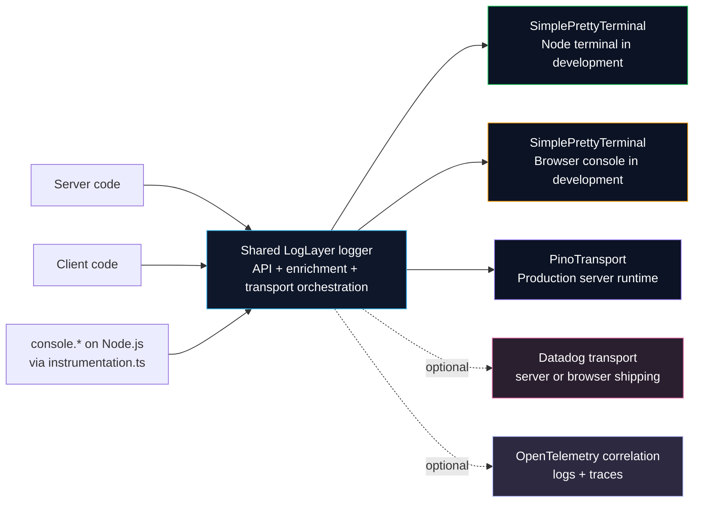

import { BlogPost } from '@/components/blog/post';

export const meta = {
  title:
    'Logging in Next.js with LogLayer: Instrumentation, Console Override, and Structured Logs',
  summary:
    'How to centralize server and client logs with one logger, intercept console.* in instrumentation.ts, and use structured logging in Next.js.',
  publishedAt: '2026-04-12',
  state: 'published',
  views: 0,
  readingTime: '8 min read',
  tags: ['Next.js', 'Observability', 'Logging', 'LogLayer', 'Pino'],
};

export const metadata = {
  title: `${meta.title} | Yuri Mutti`,
  description: meta.summary,
};

<BlogPost meta={meta}>

## Logging in Next.js with LogLayer: Instrumentation, Console Override, and Structured Logs

Next.js gives you multiple runtimes, but it does not give you one logging model across all of them. Server code, client code, and raw `console.*` calls quickly drift apart. Output shape changes. Errors serialize poorly. Metadata gets lost.

This post shows a practical way to fix that with LogLayer.

The demo repository, [`nextjs-loglayer`](https://github.com/yurimutti/nextjs-loglayer), uses one shared logger, overrides `console.*` on the Node.js runtime through `instrumentation.ts`, and keeps direct structured logging available in both server and client code.

You end up with one mental model for logs across the app.

---

### Why logging feels inconsistent in Next.js

If you rely on `console.log` directly, the experience breaks down fast.

- Output differs between server and browser
- Logs have weak structure
- Metadata handling is ad hoc
- Errors are not serialized consistently
- Your app code and third-party code do not flow through one logging layer
- Debugging gets harder when logs come from multiple runtimes

This is the real problem. You do not just need more logs. You need logs that behave the same way.

---

### Why use LogLayer

LogLayer gives you one API for application logging while still letting you swap transports by runtime and environment.

In this example, it provides:

- One shared logger instance
- Readable logs in development with `SimplePrettyTerminal`
- Structured server logs in production with `PinoTransport`
- Error serialization through `serialize-error`
- Context, metadata, and error enrichment through the LogLayer API

It also gives you a clean transport boundary.

Your application code can stay pointed at LogLayer even if your output target changes later. You can start with terminal output and Pino, then add external platforms such as Datadog or OpenTelemetry-based pipelines later.

This demo does not implement those integrations. It shows the boundary where they would fit.

---

### Architecture overview

The example uses one shared LogLayer instance across the app.

On the server, `instrumentation.ts` intercepts `console.*` and routes those calls into the same logger instance that your application uses directly. That puts legacy logs, framework-adjacent logs, and explicit `log.info()` calls on one path.

On the client, your components use the same logger API, but development output goes to the browser console, not the Node.js terminal. In production on the server, the logger switches from pretty output to `PinoTransport`.



The solid lines show what this repository implements today. The dotted lines show where optional transports and observability layers can plug in later.

This repository keeps the baseline small. It implements console interception, one shared logger, `SimplePrettyTerminal`, `PinoTransport`, and structured enrichment through `withContext()`, `withMetadata()`, and `withError()`.

---

### `instrumentation.ts` and console override

The example places `instrumentation.ts` at the project root so Next.js can discover it.

```ts
export async function register() {
  if (process.env.NEXT_RUNTIME === 'nodejs') {
    const { log } = await import('./src/lib/logger');
    const { createConsoleMethod } =
      await import('./src/lib/logger/utils/console');

    console.error = createConsoleMethod(log, 'error');
    console.log = createConsoleMethod(log, 'log');
    console.info = createConsoleMethod(log, 'info');
    console.warn = createConsoleMethod(log, 'warn');
    console.debug = createConsoleMethod(log, 'debug');
  }
}
```

This is the right place to intercept `console.*` in the Node.js runtime.

Two details matter.

First, the file must live in the correct root-level location. If Next.js does not pick it up, the override never runs.

Second, the runtime guard matters. The example only overrides `console.*` when `process.env.NEXT_RUNTIME === 'nodejs'`. That prevents Node-only behavior from leaking into unsupported runtimes.

This override is useful even if you already use structured logging directly. It captures logs from older code and libraries that still call `console.*`.

---

### Main logger setup

The logger lives in `src/lib/logger/index.ts`.

```ts
import { LogLayer, type PluginBeforeMessageOutParams } from 'loglayer';
import { PinoTransport } from '@loglayer/transport-pino';
import { getSimplePrettyTerminal } from '@loglayer/transport-simple-pretty-terminal';
import { pino } from 'pino';
import { serializeError } from 'serialize-error';

const isServer = typeof window === 'undefined';
const isClient = !isServer;
const pinoLogger = pino({ level: 'trace' });

export const log = new LogLayer({
  prefix: '[yurimutti.com]',
  errorFieldName: 'error',
  errorSerializer: serializeError,
  transport: [
    getSimplePrettyTerminal({
      enabled: process.env.NODE_ENV === 'development',
      runtime: isServer ? 'node' : 'browser',
      viewMode: isServer ? 'inline' : 'message-only',
      includeDataInBrowserConsole: isClient,
    }),
    new PinoTransport({
      enabled: isServer && process.env.NODE_ENV === 'production',
      logger: pinoLogger,
    }),
  ],
  plugins: [
    {
      onBeforeMessageOut(params: PluginBeforeMessageOutParams) {
        const tag = isServer ? 'Server' : 'Client';

        if (params.messages?.length && typeof params.messages[0] === 'string') {
          params.messages[0] = `[${tag}] ${params.messages[0]}`;
        }

        return params.messages;
      },
    },
  ],
});

log.withContext({ isServer });

export function getLogger() {
  return log;
}
```

This file sets the rules for the whole app.

- One global logger instance
- Prefix for every entry: `[yurimutti.com]`
- Runtime tag injected by plugin: `[Server]` or `[Client]`
- `SimplePrettyTerminal` in development for readable output
- `PinoTransport` in production on the server
- `serialize-error` for consistent error payloads

The persistent context is also important.

```ts
log.withContext({ isServer });
```

`withContext()` persists. It sticks to the logger chain so you can carry stable fields across multiple messages.

That is different from `withMetadata()` and `withError()`, which apply to a single log entry.

The `transport` array is also the boundary for future backends. In this demo, it stays intentionally small: `SimplePrettyTerminal` for development and `PinoTransport` for production on the server. If you later want Datadog or other delivery backends, this is where they belong.

---

### Console bridge utility

The console override works because `src/lib/logger/utils/console.ts` maps `console.*` calls into the LogLayer API.

This utility does more than forward strings.

- `console.log` gets mapped to `info`
- ANSI escape codes are stripped from terminal output
- `Error` objects get routed through `withError()`
- Plain objects become metadata
- Mixed argument shapes are handled explicitly

The core behavior looks like this:

```ts
if (method === 'log') {
  mappedMethod = 'info';
}

let finalMessage = stripAnsiCodes(messages.join(' ')).trim();

if (finalMessage === '⨯' && error) {
  finalMessage = error.message || '';
}

if (error && hasData && messages.length > 0) {
  log.withError(error).withMetadata(data)[mappedMethod](finalMessage);
} else if (error && messages.length > 0) {
  log.withError(error)[mappedMethod](finalMessage);
} else if (hasData && messages.length > 0) {
  log.withMetadata(data)[mappedMethod](finalMessage);
} else if (error && hasData && messages.length === 0) {
  log.withError(error).withMetadata(data)[mappedMethod]('');
} else if (error && messages.length === 0) {
  log.errorOnly(error);
} else if (hasData && messages.length === 0) {
  log.metadataOnly(data);
} else {
  log[mappedMethod](finalMessage);
}
```

That logic matters because real `console.*` usage is messy. Sometimes you log a message and an error. Sometimes only an object. Sometimes only an `Error` instance. The bridge normalizes those cases so the output stays structured.

---

### Server demo

The server example lives in `src/app/log-demo/server/page.tsx`.

It starts with this:

```ts
export const dynamic = 'force-dynamic';
```

That line is there for a reason. It forces the route to execute on every request, which makes the logging demo visible every time you refresh the page.

The route shows both styles side by side.

```ts
console.log('Server console override demo', { route: '/log-demo/server' });

log.withMetadata({ some: 'data' }).info('Hello, world!');

log
  .child()
  .withContext({ requestId: 'abc' })
  .withMetadata({ duration: 150 })
  .withError(new Error('fail'))
  .error('Request failed');
```

Observed terminal output:

```txt
[21:49:12.580] ▶ INFO [Server] [yurimutti.com] Server console override demo isServer=true route=/log-demo/server
[21:49:12.580] ▶ INFO [Server] [yurimutti.com] Hello, world! isServer=true some=data
[21:49:12.581] ▶ ERROR [Server] [yurimutti.com] Request failed isServer=true requestId=abc duration=150 error.name=Error error.message=fail
```

This is the most useful part of the demo.

It shows that:

- `console.log` gets captured by the override
- `withContext({ isServer: true })` on the shared logger shows up on every server entry
- direct LogLayer calls stay available
- `withContext()` persists through the child logger chain
- `withMetadata()` adds per-entry fields
- `withError()` attaches the error only to that specific entry

That last chained example is the one to copy into real code.

---

### Client demo

The client example uses `src/components/client-log-effect.tsx` and `src/app/log-demo/client/page.tsx`.

It logs during `useEffect`.

```ts
'use client';

useEffect(() => {
  console.log('Client console override demo', {
    source: 'useEffect',
    page: '/log-demo/client',
  });

  log
    .withContext({ requestId: 'client-abc' })
    .withMetadata({ source: 'useEffect', page: '/log-demo/client' })
    .info('Client mounted');
}, []);
```

Observed browser console output:

```txt
Client console override demo { source: "useEffect", page: "/log-demo/client" }
[21:50:40.595] ▶ INFO [Client] [yurimutti.com] Client mounted { isServer: "false", requestId: "client-abc", source: "useEffect", page: "/log-demo/client" }
```

This keeps the mental model consistent.

You still have direct logger access in the browser. You can still attach context and metadata. You can also compare the raw `console.log` call with the direct `log.info()` call and see how each behaves.

One nuance matters here.

Server logs appear in the terminal. Client logs appear in the browser console. In dev mode, Next.js can also replay a server `console.log` entry in the browser with a `Server` badge. The output destination changes, but the logger API and enrichment model stay the same.

---

### Expected output

In development, you should see readable logs from `SimplePrettyTerminal`, plus the shared prefix and runtime tag.

Observed output looks like this:

```text
[21:49:12.580] ▶ INFO [Server] [yurimutti.com] Server console override demo isServer=true route=/log-demo/server
[21:49:12.580] ▶ INFO [Server] [yurimutti.com] Hello, world! isServer=true some=data
[21:49:12.581] ▶ ERROR [Server] [yurimutti.com] Request failed isServer=true requestId=abc duration=150 error.name=Error error.message=fail
[21:50:40.595] ▶ INFO [Client] [yurimutti.com] Client mounted { isServer: "false", requestId: "client-abc", source: "useEffect", page: "/log-demo/client" }
```

That consistency is the main win.

Both runtimes use the same logger. Both can attach context. Both can attach metadata. On the server, raw `console.*` also flows through the instrumentation override.

---

### Future extension points

This repository keeps the example focused, but the shape scales cleanly.

If you later want log shipping to Datadog, this is where Datadog transports fit. If you later want logs to line up with traces, this is where OpenTelemetry correlation belongs.

The important rule is to keep vendor-specific concerns out of feature code and let LogLayer remain the stable API boundary.

---

### How to run the example

```bash
npm i
npm run dev
```

Then open:

1. `/`
2. `/log-demo/server`
3. `/log-demo/client`

To verify the production build:

```bash
npm run build
```

### 👉 Find the code for this article on GitHub: [yurimutti/nextjs-loglayer](https://github.com/yurimutti/nextjs-loglayer)

---

### Key takeaways

1. `instrumentation.ts` is the right place to intercept `console.*` in the Node.js runtime
2. One shared LogLayer instance gives you a consistent logging API across the app
3. `withContext()` persists, while `withMetadata()` and `withError()` apply to one entry
4. `PinoTransport` is the production server transport in this demo
5. Datadog and OpenTelemetry fit naturally as future transport and correlation layers
6. This pattern gives you a practical baseline before external log shipping

---

### Conclusion

If your Next.js logs feel fragmented, the fix is not complicated. Put the console interception in `instrumentation.ts`, route server-side `console.*` into LogLayer, and keep one shared logger instance for direct structured logging.

That gives you a practical baseline.

You get readable development logs, structured production server logs, cleaner error handling, and one consistent API across the app. You also keep a clean path open for optional transports and observability backends later.

<hr />

1. [https://nextjs.org/docs/app/guides/instrumentation](https://nextjs.org/docs/app/guides/instrumentation)
2. [https://nextjs.org/docs/pages/api-reference/file-conventions/instrumentation](https://nextjs.org/docs/pages/api-reference/file-conventions/instrumentation)
3. [https://loglayer.dev](https://loglayer.dev)
4. [https://loglayer.dev/example-integrations/nextjs.html](https://loglayer.dev/example-integrations/nextjs.html)
5. [https://loglayer.dev/transports/pino.html](https://loglayer.dev/transports/pino.html)
6. [https://loglayer.dev/transports/simple-pretty-terminal.html](https://loglayer.dev/transports/simple-pretty-terminal.html)
7. [https://github.com/vercel/next.js/discussions/63787](https://github.com/vercel/next.js/discussions/63787)

</BlogPost>
