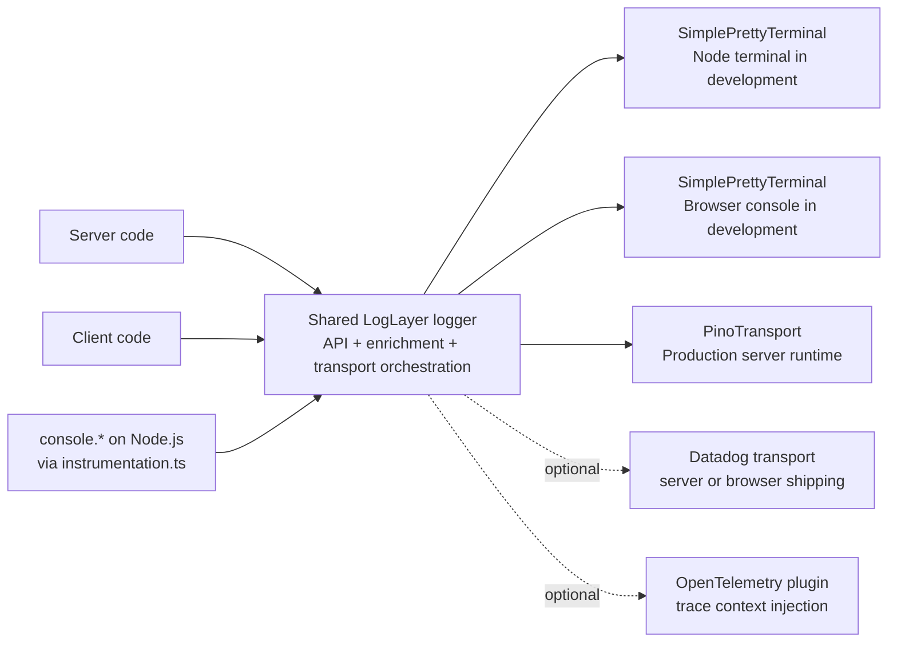

import { BlogPost } from '@/components/blog/post';

export const meta = {
  title:
    'Logging in Next.js with LogLayer: Instrumentation, Console Override, and Structured Logs',
  summary:
    'How to centralize server, client, and edge logs with one logger, intercept console.* in instrumentation.ts, and use structured logging in Next.js.',
  publishedAt: '2026-04-12',
  state: 'published',
  views: 0,
  readingTime: '10 min read',
  tags: [
    'Next.js',
    'Observability',
    'Logging',
    'LogLayer',
    'Pino',
    'Edge Runtime',
  ],
};

export const metadata = {
  title: `${meta.title} | Yuri Mutti`,
  description: meta.summary,
};

<BlogPost meta={meta}>

Next.js gives you multiple runtimes, but not one logging model across them. Server code, client code, and raw `console.*` calls drift apart: output shape changes, errors serialize poorly, metadata gets lost.

The fix I use is LogLayer. The demo repository, [`nextjs-loglayer`](https://github.com/yurimutti/nextjs-loglayer), runs one shared logger, overrides `console.*` on the Node.js runtime through `instrumentation.ts`, and keeps direct structured logging in both server and client code. The result is one mental model for logs across the app.

### Why logging feels inconsistent in Next.js

Rely on `console.log` directly and the experience breaks down fast.

- Output differs between server and browser
- Logs have weak structure
- Metadata handling is ad hoc
- Errors are not serialized consistently
- Your app code and third-party code do not flow through one logging layer
- Debugging gets harder when logs come from multiple runtimes

The problem is not the number of logs. It is that they do not behave the same way.

### Why use LogLayer

LogLayer gives you one API for application logging while still letting you swap transports by runtime and environment.

In this example, it provides:

- One shared logger instance
- Readable logs in development with `SimplePrettyTerminal`
- Structured server logs in production with `PinoTransport`
- Error serialization through `serialize-error`
- Context, metadata, and error enrichment through the LogLayer API

It also gives you a clean transport boundary. Your application code can stay pointed at LogLayer even if the output target changes later. You can start with terminal output and Pino, then add external platforms such as Datadog or OpenTelemetry-based pipelines later.

This demo does not implement those integrations. It shows the boundary where they would fit.

### Architecture overview

The example uses one shared LogLayer instance across the app.

On the server, `instrumentation.ts` intercepts `console.*` and routes those calls into the same logger instance your application uses directly. That puts legacy logs, framework-adjacent logs, and explicit `log.info()` calls on one path.

On the client, your components use the same logger API, but development output goes to the browser console, not the Node.js terminal. In production on the server, the logger switches from pretty output to `PinoTransport`.


```mermaid
flowchart LR
    A["Server code"] --> D["Shared LogLayer logger<br/>API + enrichment + transport orchestration"]
    B["Client code"] --> D
    C["console.* on Node.js<br/>via instrumentation.ts"] --> D

    D --> E["SimplePrettyTerminal<br/>Node terminal in development"]
    D --> F["SimplePrettyTerminal<br/>Browser console in development"]
    D --> G["PinoTransport<br/>Production server runtime"]

    D -. optional .-> H["Datadog transport<br/>server or browser shipping"]
    D -. optional .-> I["OpenTelemetry plugin<br/>trace context injection"]
```

The solid lines show what this repository implements today. The dotted lines show where optional transports and observability layers can plug in later.

The baseline stays small: console interception, one shared logger, `SimplePrettyTerminal`, `PinoTransport`, and structured enrichment through `withContext()`, `withMetadata()`, and `withError()`.

### `instrumentation.ts` and console override

The example places `instrumentation.ts` at the project root so Next.js can discover it.

```ts
export async function register() {
  if (process.env.NEXT_RUNTIME === 'nodejs') {
    const { log } = await import('./src/lib/logger');
    const { createConsoleMethod } = await import(
      './src/lib/logger/utils/console'
    );

    console.error = createConsoleMethod(log, 'error');
    console.log = createConsoleMethod(log, 'log');
    console.info = createConsoleMethod(log, 'info');
    console.warn = createConsoleMethod(log, 'warn');
    console.debug = createConsoleMethod(log, 'debug');
  }
}
```

Two details matter.

First, the file must live in the correct location. Next.js supports the project root or inside `src/` when your app uses that layout. If it is not found, the override never runs.

Second, the runtime guard. The example only overrides `console.*` when `process.env.NEXT_RUNTIME === 'nodejs'`, which keeps Node-only behavior out of runtimes that cannot support it.

This override is useful even if you already log through a structured API directly. It captures logs from older code and libraries that still call `console.*`.

### Main logger setup

The logger lives in `src/lib/logger/index.ts`.

```ts
import { LogLayer, type PluginBeforeMessageOutParams } from 'loglayer';
import { PinoTransport } from '@loglayer/transport-pino';
import { getSimplePrettyTerminal } from '@loglayer/transport-simple-pretty-terminal';
import { pino } from 'pino';
import { serializeError } from 'serialize-error';

const isServer = typeof window === 'undefined';
const isClient = !isServer;
const pinoLogger = pino({ level: 'trace' });

export const log = new LogLayer({
  prefix: '[yurimutti.com]',
  errorFieldName: 'error',
  errorSerializer: serializeError,
  transport: [
    getSimplePrettyTerminal({
      enabled: process.env.NODE_ENV === 'development',
      runtime: isServer ? 'node' : 'browser',
      viewMode: isServer ? 'inline' : 'message-only',
      includeDataInBrowserConsole: isClient,
    }),
    new PinoTransport({
      enabled: isServer && process.env.NODE_ENV === 'production',
      logger: pinoLogger,
    }),
  ],
  plugins: [
    {
      onBeforeMessageOut(params: PluginBeforeMessageOutParams) {
        const tag = isServer ? 'Server' : 'Client';

        if (params.messages?.length && typeof params.messages[0] === 'string') {
          params.messages[0] = `[${tag}] ${params.messages[0]}`;
        }

        return params.messages;
      },
    },
  ],
});

log.withContext({ isServer });

export function getLogger() {
  return log;
}
```

This file sets the rules for the whole app.

- One global logger instance
- Prefix on every entry: `[yurimutti.com]`
- Runtime tag injected by plugin: `[Server]` or `[Client]`
- `SimplePrettyTerminal` in development for readable output
- `PinoTransport` in production on the server
- `serialize-error` for consistent error payloads

One line is worth calling out.

```ts
log.withContext({ isServer });
```

`withContext()` persists. It sticks to the logger chain, so you can carry stable fields across multiple messages. That is different from `withMetadata()` and `withError()`, which apply to a single entry.

The `transport` array is the boundary for future backends. In this demo it stays small: `SimplePrettyTerminal` for development and `PinoTransport` for production on the server. If you later want Datadog or another delivery backend, this is where it belongs.

### Console bridge utility

The console override works because `src/lib/logger/utils/console.ts` maps `console.*` calls into the LogLayer API.

This utility does more than forward strings.

- `console.log` maps to `info`
- ANSI escape codes are stripped from terminal output
- `Error` objects are routed through `withError()`
- Plain objects become metadata
- Mixed argument shapes are handled explicitly

The core behavior looks like this:

```ts
if (method === 'log') {
  mappedMethod = 'info';
}

let finalMessage = stripAnsiCodes(messages.join(' ')).trim();

if (finalMessage === '⨯' && error) {
  finalMessage = error.message || '';
}

if (error && hasData && messages.length > 0) {
  log.withError(error).withMetadata(data)[mappedMethod](finalMessage);
} else if (error && messages.length > 0) {
  log.withError(error)[mappedMethod](finalMessage);
} else if (hasData && messages.length > 0) {
  log.withMetadata(data)[mappedMethod](finalMessage);
} else if (error && hasData && messages.length === 0) {
  log.withError(error).withMetadata(data)[mappedMethod]('');
} else if (error && messages.length === 0) {
  log.errorOnly(error);
} else if (hasData && messages.length === 0) {
  log.metadataOnly(data);
} else {
  log[mappedMethod](finalMessage);
}
```

That logic matters because real `console.*` usage is messy. Sometimes you log a message and an error. Sometimes only an object. Sometimes only an `Error` instance. The bridge normalizes those cases so the output stays structured.

### Server demo

The server example lives in `src/app/log-demo/server/page.tsx`.

It starts with this:

```ts
export const dynamic = 'force-dynamic';
```

That forces the route to run on every request, so the demo logs on every refresh.

The route shows both styles side by side.

```ts
console.log('Server console override demo', { route: '/log-demo/server' });

log.withMetadata({ some: 'data' }).info('Hello, world!');

log
  .child()
  .withContext({ requestId: 'abc' })
  .withMetadata({ duration: 150 })
  .withError(new Error('fail'))
  .error('Request failed');
```

Observed terminal output:

```txt
[21:49:12.580] ▶ INFO [Server] [yurimutti.com] Server console override demo isServer=true route=/log-demo/server
[21:49:12.580] ▶ INFO [Server] [yurimutti.com] Hello, world! isServer=true some=data
[21:49:12.581] ▶ ERROR [Server] [yurimutti.com] Request failed isServer=true requestId=abc duration=150 error.name=Error error.message=fail
```

The output shows several things at once.

- `console.log` is captured by the override
- `withContext({ isServer: true })` on the shared logger shows up on every server entry
- direct LogLayer calls stay available
- `withContext()` persists through the child logger chain
- `withMetadata()` adds per-entry fields
- `withError()` attaches the error only to that specific entry

That chained example is the pattern to copy into real code.

### Client demo

The client example uses `src/components/client-log-effect.tsx` and `src/app/log-demo/client/page.tsx`.

It logs during `useEffect`.

```ts
'use client';

useEffect(() => {
  console.log('Client console override demo', {
    source: 'useEffect',
    page: '/log-demo/client',
  });

  log
    .withContext({ requestId: 'client-abc' })
    .withMetadata({ source: 'useEffect', page: '/log-demo/client' })
    .info('Client mounted');
}, []);
```

Observed browser console output:

```txt
Client console override demo { source: "useEffect", page: "/log-demo/client" }
[21:50:40.595] ▶ INFO [Client] [yurimutti.com] Client mounted { isServer: false, requestId: "client-abc", source: "useEffect", page: "/log-demo/client" }
```

Direct logger access still works in the browser, and you can still attach context and metadata. Comparing the raw `console.log` call with the direct `log.info()` call shows how each behaves.

One nuance. Server logs appear in the terminal, client logs appear in the browser console. In dev mode, Next.js can also replay a server `console.log` entry in the browser with a `Server` badge. The output destination changes, but the logger API and enrichment model stay the same.

### Expected output

In development you should see readable logs from `SimplePrettyTerminal`, plus the shared prefix and runtime tag.

```text
[21:49:12.580] ▶ INFO [Server] [yurimutti.com] Server console override demo isServer=true route=/log-demo/server
[21:49:12.580] ▶ INFO [Server] [yurimutti.com] Hello, world! isServer=true some=data
[21:49:12.581] ▶ ERROR [Server] [yurimutti.com] Request failed isServer=true requestId=abc duration=150 error.name=Error error.message=fail
[21:50:40.595] ▶ INFO [Client] [yurimutti.com] Client mounted { isServer: "false", requestId: "client-abc", source: "useEffect", page: "/log-demo/client" }
```

Both runtimes use the same logger, both can attach context and metadata, and on the server raw `console.*` also flows through the instrumentation override.

### Future extension points

The example stays focused, but the shape scales.

If you later want log shipping to Datadog, this is where `@loglayer/transport-datadog` (server) and `@loglayer/transport-datadog-browser-logs` (browser) belong. If you want trace context on logs, the right primitive is `@loglayer/plugin-opentelemetry`, which stamps `trace_id` and `span_id` onto entries. If you already run an OpenTelemetry log processor pipeline, `@loglayer/transport-opentelemetry` fits instead.

For Edge routes, you need a separate `LogLayer` instance. The Node.js logger imports Pino, which breaks the Edge bundle at build time. Use `@loglayer/transport-http` with `enableNextJsEdgeCompat: true` instead.

Keep vendor-specific concerns out of feature code and let LogLayer stay the stable API boundary.

### How to run the example

```bash
npm i
npm run dev
```

Then open:

1. `/`
2. `/log-demo/server`
3. `/log-demo/client`

To verify the production build:

```bash
npm run build
```

The full code for this article is on GitHub: [yurimutti/nextjs-loglayer](https://github.com/yurimutti/nextjs-loglayer).

### Conclusion

If your Next.js logs feel fragmented, the recipe is short. Put console interception in `instrumentation.ts`, route server-side `console.*` into LogLayer, and keep one shared logger instance for direct structured logging.

You get readable development logs, structured production server logs, cleaner error handling, and one consistent API across the app, with a clean path open for optional transports and observability backends later.

<hr />

1. [https://nextjs.org/docs/app/guides/instrumentation](https://nextjs.org/docs/app/guides/instrumentation)
2. [https://nextjs.org/docs/pages/api-reference/file-conventions/instrumentation](https://nextjs.org/docs/pages/api-reference/file-conventions/instrumentation)
3. [https://loglayer.dev](https://loglayer.dev)
4. [https://loglayer.dev/example-integrations/nextjs.html](https://loglayer.dev/example-integrations/nextjs.html)
5. [https://loglayer.dev/transports/pino.html](https://loglayer.dev/transports/pino.html)
6. [https://loglayer.dev/transports/simple-pretty-terminal.html](https://loglayer.dev/transports/simple-pretty-terminal.html)
7. [https://github.com/vercel/next.js/discussions/63787](https://github.com/vercel/next.js/discussions/63787)

</BlogPost>
